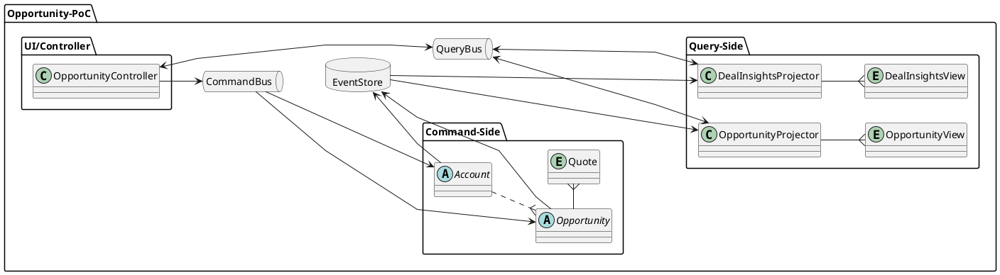

```plantuml
@startuml

left to right direction
skinparam linetype polyline

package Opportunity-PoC {

    together {
        queue CommandBus {
        }
        
        database EventStore {
        }
        
        queue QueryBus {
        }
        
        CommandBus -[hidden]-> EventStore
        EventStore -[hidden]-> QueryBus
    }

    package UI/Controller {
        class OpportunityController
        
        OpportunityController -d-> CommandBus
        OpportunityController <-d-> QueryBus
    }
   

    package Command-Side {
        abstract Account
        Account ..{ Opportunity
    
        abstract Opportunity
        Entity Quote
        Opportunity -{ Quote
        
        CommandBus ----> Account
        CommandBus ----> Opportunity
    
        Account ----> EventStore
        Opportunity ----> EventStore
    }
    
    package Query-Side {
        class DealInsightsProjector
        entity DealInsightsView
        DealInsightsProjector --{ DealInsightsView 
        
        
        class OpportunityProjector
        entity OpportunityView
        OpportunityProjector --{ OpportunityView
        
        QueryBus <----> DealInsightsProjector
        QueryBus <----> OpportunityProjector
        
        EventStore ----> DealInsightsProjector
        EventStore ----> OpportunityProjector
    }
}

@enduml
```