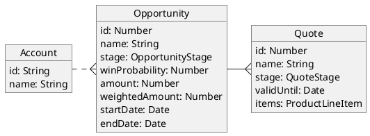

```plantuml
@startuml

object Account
Account : id: String
Account : name: String

object Opportunity
Opportunity : id: Number 
Opportunity : name: String 
Opportunity : stage: OpportunityStage 
Opportunity : winProbability: Number 
Opportunity : amount: Number 
Opportunity : weightedAmount: Number 
Opportunity : startDate: Date 
Opportunity : endDate: Date 

object Quote
Quote : id: Number
Quote : name: String
Quote : stage: QuoteStage
Quote : validUntil: Date
Quote : items: ProductLineItem

Account .r.{ Opportunity
Opportunity -r-{ Quote

@enduml
```